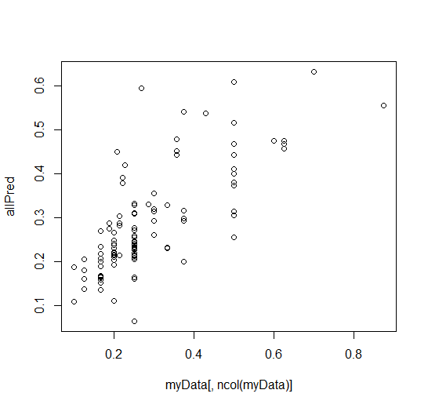
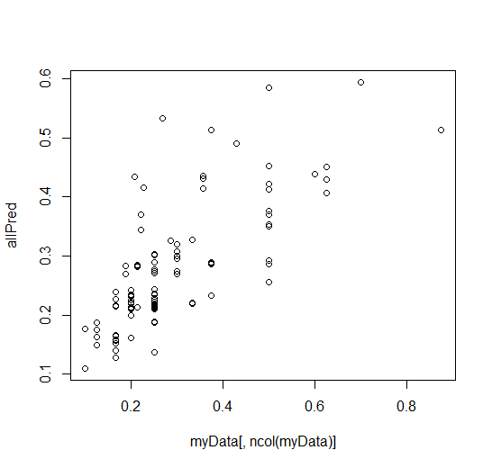
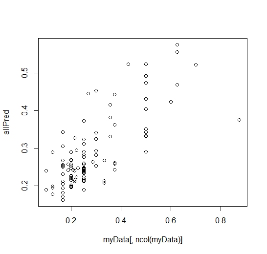

# Modelling and Cross validation

## Updates

This week we were able to reach our objective we set at the start of the semester. We were able to model our data and cross validate it

## Modelling

For modelling we used 3 machine learning algorithms 

* Random Forest 
* Linear Model
* svm using eps-regression

The paramters we gave in to algorithims were

1. start temp
2. target/end temp
3. avg CO2 in room
4. start outside temp

## Techiniques of modelling and cross validation

Our function produced a dataframe holding all the heating periods from July, August, September. The coloumns were start_temp, end-temp, start-outside temp, CO2 level and finally the rate per 15 minutes in that interval.

Our aim was to experiment to see if we can find a model that can predict fairly accurately the rate of heating of the ac. 

### How are we cross validating our model?

We partioned the data into 7 segments. We trained 6 parts and the last one was for predicting. We've done 7 iterations of that and produced an entire dataframe of predicted results and compared it to the actual rates. 

Below is all models we produced and their accuracies tested against cross validation.

### Linear Model (lm())

We produced a multiple linear regression and we had a square mean error of 0.0955891 which is really good. Below is a plot of actual results plotted against predicted.

### SVM 

Using eps classification which is mainly used in regression. The squre mean error for this was 0.094 which is really good. 

### Random Forest

For random forest we chose to fit 500 decision trees however it might not be the optimal number. Also we found it had a mean error of 0.091

## Plans for the rest of semester

Try to properly learn neural networks in the context of our research and apply it and finally produce a draft for the research paper. We'll also need to decide what is most relevent for us to produce for the poster.