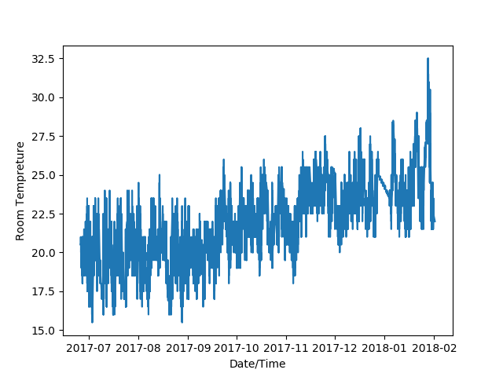
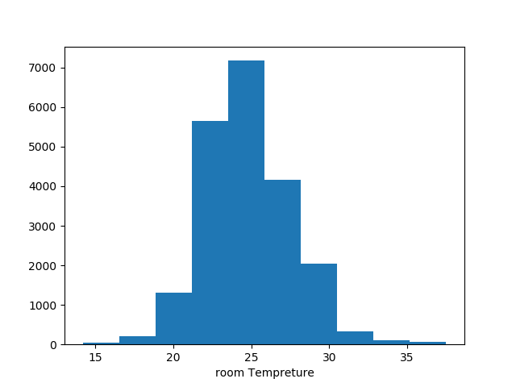

# Simulation of air conditioners 

## update

1. I have written up a data cleaning function which accepts a file as input and throws a cleaned file 
stripping lines which have incomplete data.
2. Selected a particular room for analysis

## Analysis

We decided to take the approach of narrowing down our objectives in the first phase which is to analyse
the rates at which the AC cools and heats for example a room can heat up all night in the summer in which noone occupies the room. However when it is morning and people come, it might take the AC 30 to 40 minutes in full cooling capacity to bring the room back to setpoint range or maybe it might take 5 minutes. 

So what we are trying to do is to analyze those rates and once we can collate enough data, we can test whether the model can predict how long the AC will take to reach a particular setpoint.

Currently we are analysing room tempreture and trying to identify the rate of cooling and heating

These are some plots of the distrubution of tempreture across the year and also a histogram is provided just to get an idea of how a data looks 

## plans for next week

1. We decided to migrate to R as that is what our supervisor Christoph has more experience in.
2. We need to pick a particular day for analysis and try to see if we can create a function which accurately idenfies the heating and cooling periods signified by change of rate and to find the particular gradient for it. It will be quite tricky but not impossible. Christoph gave us the code which fits exponential models but instead we'll try to change and integrate it to see if we can get a linear model out of it.

