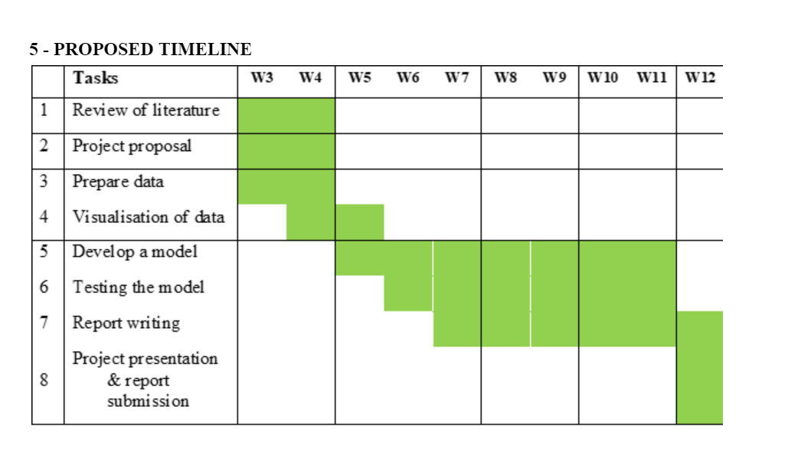

# Overview

## Completed Tasks
* Our modelling function is ready such that we can give it a set of time series and it fits a linear model to each throwing the a and b values from the the simple line equation a + bx.

* Submitted the research proposal

## Next week plan

In the meeting we decided we need to visualize our dataset properly by looking at all the variable. We need to create a function which will merge all the variables into one nice plot. We need to merge outside tempreture to our target file as it is not found in every file

1. We need to put this in a series of pdf form.
2. We are planning to have two pdf folders; one for 2 weeks in july and 2 weeks in December. - Basis for discusssion in our meeting.

Our plan we are setting out is below

