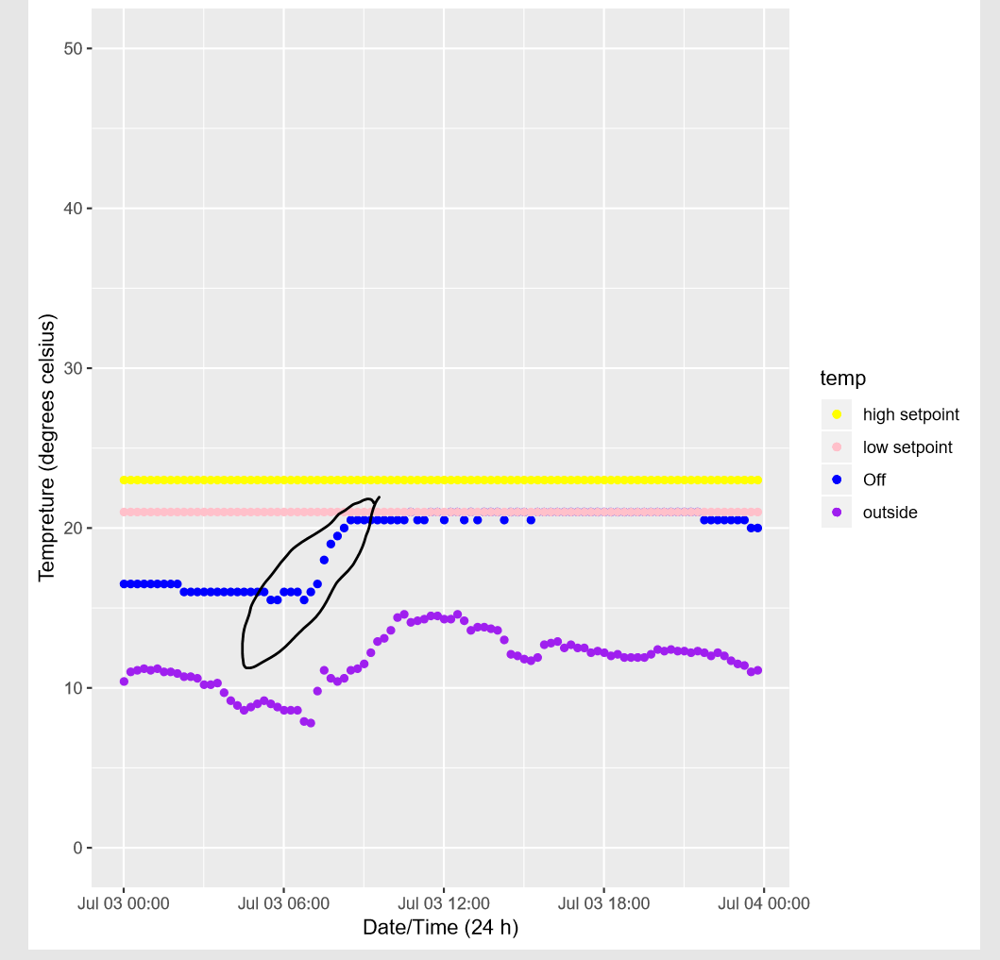
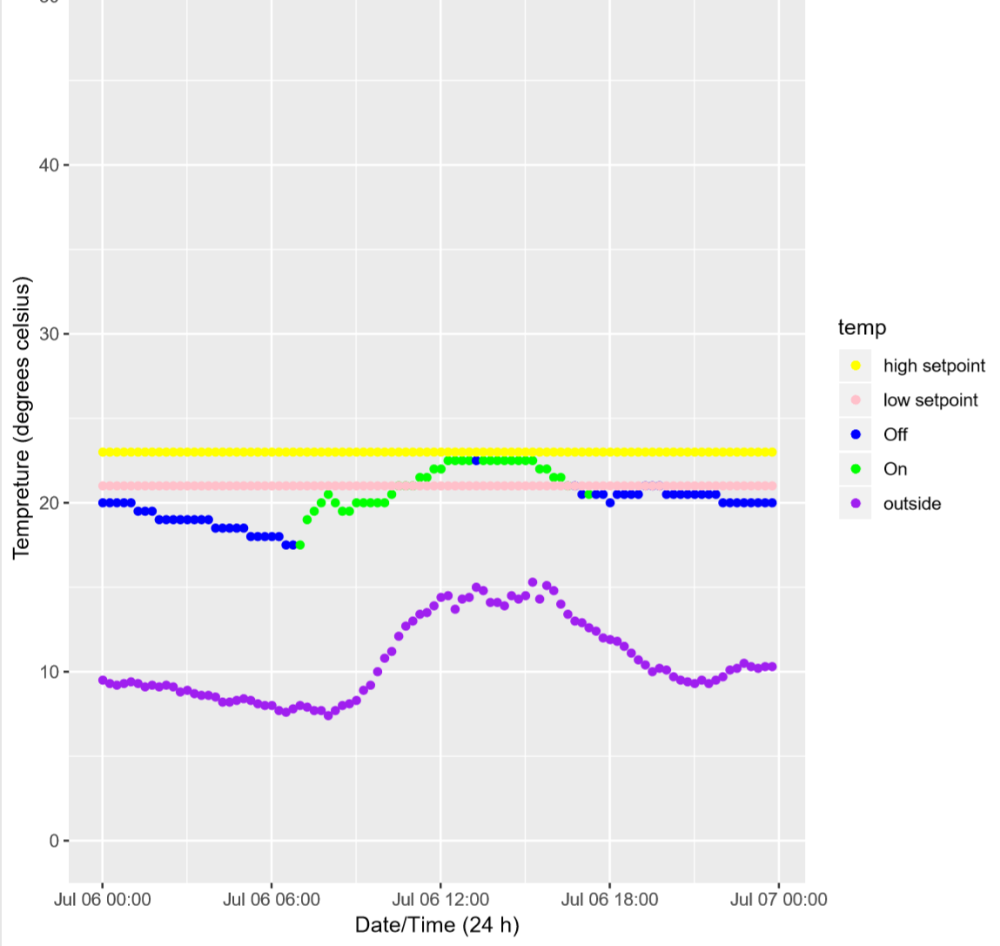

## Progress update

* This week we produced plots on july, august, november, december - for every day
* The purpose of it was to analyse our dataset and see if we can find some trend in the data we were hoping for 

## Problems we encountered

* We have a variable AC_Status which tells us when the AC is on. However in the analysis we found out that most of it seems to be off.

As you can see from above that the points are not correctly labelled. The rise of tempreture must indicate some type of AC behaviour where as it switches on. This lead us to all question the significance and accuracy of the Ac_status. We planned to ask this question to the data provider.

However we did not let this go as it is. We trialled with another variable that looked similiar and it's output made more sense eventhough we don't its meaning.

## Plans for next week 

Develop a function which takes as input specific time period and it will fit a linear model when the AC is on however there is a few things to note

* We are only trying this only in the early mornings as that it where it is more stable. 
* Usually morning are quite cold and so any significant rise can be asssociated with the AC.

