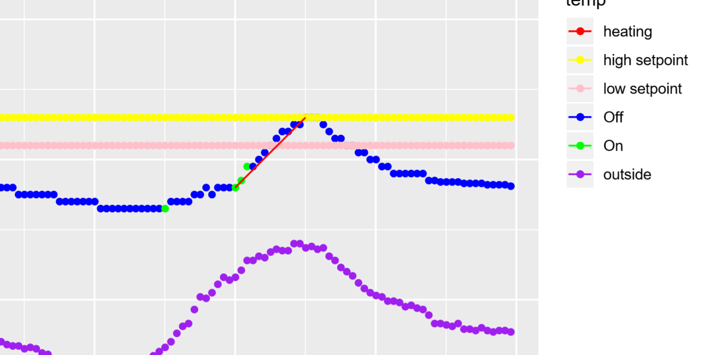
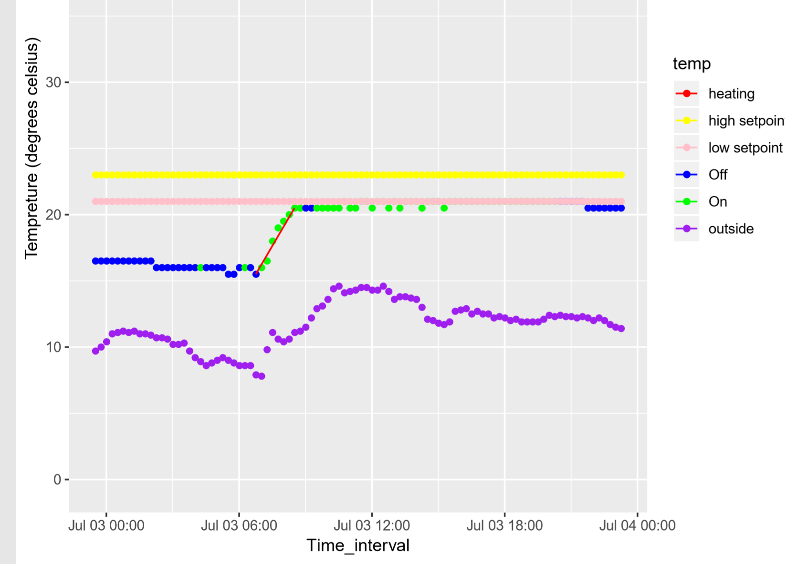

# Update

This week has been very good as we were able to achieve quite a lot.

1. We created a heat detecting algorithim that we can use - we give it a day and it throws out all relevant heating periods
2. Also if it can't find those moments of heating then it just throws an error saying "no heating detected". It's good in the sense the algorithim finds it on its own and most weekends is classified as no heating detected as the rooms are unoccupied.
3. Created a dataframe function which produces a dataframe of rate of changes especially in our case for heating. It records the slope and corresponding times.

## Some examples of the heat detection function at work

This algorithim used to detect this has plenty of heuristics involved. Some points are listed below

* How much offset by degrees should be the setpoint to cut line
* How many same values should we accept before cutting the portion of the day as heating

## plans for next week 

We have everything we need to analyse rate of changes further and model our rates of changes to what we choose.
Our plan for next meeting is what should we model against rate of change in room tempreture when AC turns on.
