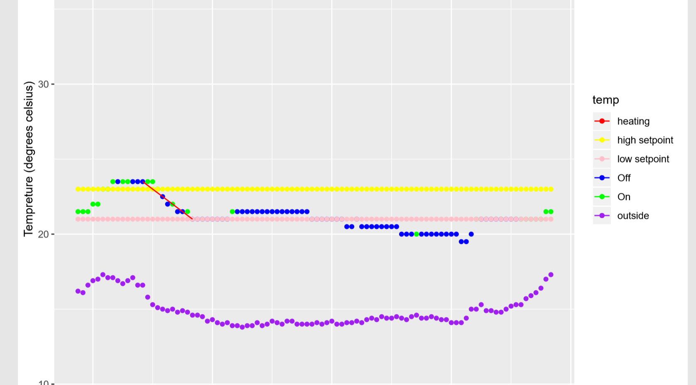

## Updates

We have made the decision that we'll be looking at rate of changes against start temp of the room or even the average tempreture.
We also came to the conclusion that the rate of outside tempreture and inside tempreture is not something worth looking at as they are both two
independent variables. However we would expect the lower start tempretures should have a higher rate of change than having a start temp
at a higher tempreture

I also had the chance to work on the cooling detection algorithim which required small tweaks from the heating detection function.

# Key points in the meeting + plans for next week

1. Make sure we split the dataframe into two segments - weekdays and weekends 
2. Use the heat detection algorithim for the summer and cooling for the weekends.
3. Look at the 3 months and produce a df and model some variables against each other(as discussed above). 
4. Primary candidates are rate of change vs start room temp vs (maybe average room temp across time interval)
4. Tweak all the function so that we can use them for the other rooms effortlessly

