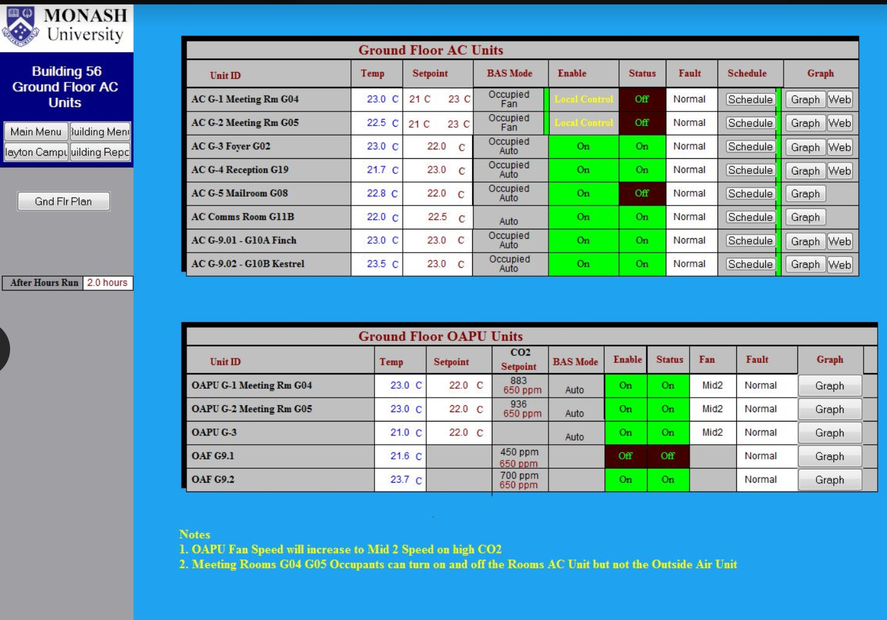
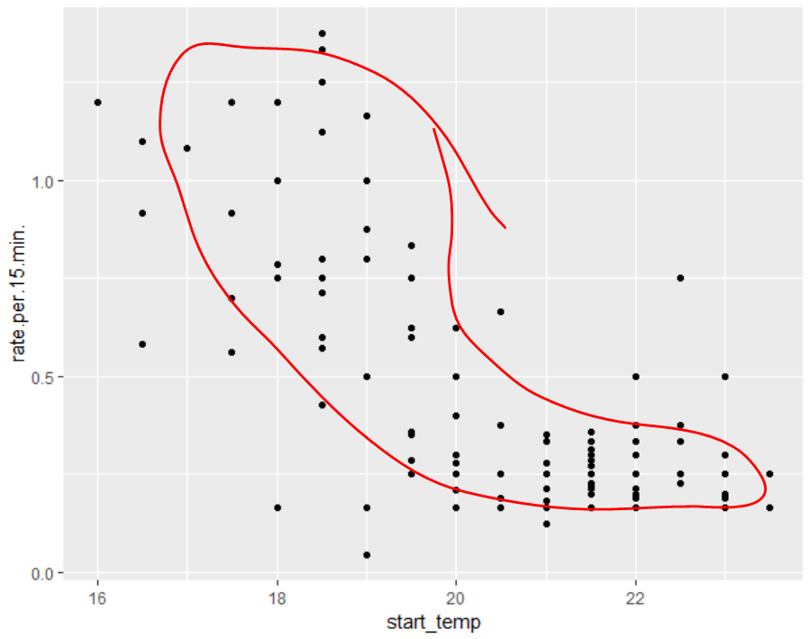

# Updates

## Completed objectives

1. Created reusable functions (with documention) - basically we have our data analysis software code package done. Now It's time to analyse all our data
2. Format function splits dataframe to weekends and weekdays
3. Both heating and cooling AI's refined and ready
4. We have Identified variables of interst in meeting which is start temp vs rate of change in room temp

## Some points in our meeting

This week we were lucky to have the 3 data providers of our current data to join us for questions we have in mind as we nearing the modelling phase.

They explained how the AC operates in the many different rooms and one particular inquiry we had was about whether the variable AC_status is reliable as it always seems to be off. We were suprised and relieved at the same time at their response. They indicated to us that the AC can be manually turned off and that sometimes the AC does not need to be turned on since there is a central OAPU which is in charge of cooling and heating. The AC is just there to act as a supporting mechamism in case the OAPU cannot handle the demand. This explained why it seemed the room heating up with AC_status marked as off(It was the central OAPU units that seemed to be operating).

This left us and our supervisors with a conundrum. How are we going to deal with this? We decided - 

* We will focus on the rooms marked as OAPU so we can be 100% sure OAPU is clearly a factor in this rooms heating and cooling.
* Also we don't want to mix the variables OAPU and AC_staus. So our proposed solution is to only look at times when AC_status is off so the two variables don't mix which could cause inaccuracy in model produced. However that has some difficulties which we will discuss in our next meeting.

We're more intersted in all OAPU operating ground rooms 

## A look at heating rates on July August September

We quickly wanted to see if we're getting something from the reforms we made to room selection based on the meeting with the data providers. We used our handy quick functions to format and put our data into a respective dataframe

The plot below is looking at rate of change in heating vs start temp

We can see some logarithmic relationship which is a good start

## plan for next week

* We hope we can rap up modelling this week and mid sem break and resort to testing the model we produce. We're quite hopeful

