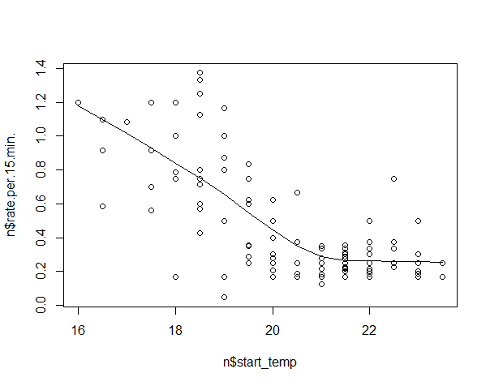

# Modelling

We are currently in the modelling phase and we are thinking of ways in which we can model our dataset. These are some things we had in mind.

* We want to produce a model which takes as parameters starting inside tempreture, starting outside temp, CO2 average reading to predict the rate of heating of the AC.
* Currently any algorithim would be fine but we will try to model it as suggested by Christoph using linear model (lm) and a random forest.
* I had any intial first attempt at producing a multiple linear regression however the resulting R^2 value was 0.572 which is not as strong as we want.

I was thinking of a couple of ways to improve on this 

* First try to linearise the data and then apply lm function.
* Do we want to model it with more than one variable since some such as CO2 average seem to have a very weak relationship?

## Tasks for next week 

First we plan to apply multiple models and pick the most accurate ones. However we need to solve the problem of linearisation of the data, which parameters are useless to incorporate
into the model and try out different techniques in the hope of finding the best model.